# シェーダ講習会
---
ゲーム制作サークルtraP

2016/4/27(水)

[next]

## 自己紹介

---

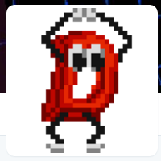

理学部1類情報科学科 学部2年

アーク

Twitter: @_arkark

[down]

## 自己紹介

---

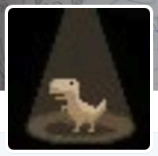

工学部5類情報工学科 学部2年

そばや

Twitter: @sobaya007

[down]

## 自己紹介

---


工学部5類情報工学科 学部2年

phi16

Twitter: @phi16_

[next]

## 講習会の内容
---
- <!-- .element: class="fragment"-->Shadertoyを使って、3Dゲーム制作でよく用いられるシェーダ技術について学んでいきます

- <!-- .element: class="fragment"-->ある程度プログラミングをやったことある人を対象とします。内容としては、Shaderやったことない人向けです

- わからないことがあったら積極的に質問しよう<!-- .element: class="fragment"-->**(←ここ重要)**<!-- .element: class="fragment"-->

[next]

## シェーダ(Shader)って何？

---

Shaderによってポリゴンを綺麗に描画できる！

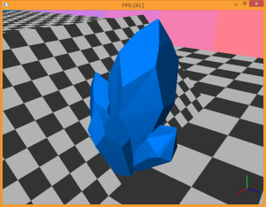<!-- .element: class="fragment"-->
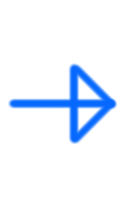<!-- .element: class="fragment" style="background:none; border:none; box-shadow:none;"-->
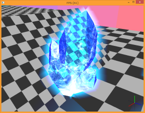<!-- .element: class="fragment"-->

[next]
## Shadertoyとは

https://www.shadertoy.com/

---
- ブラウザでフラグメントシェーダを書いたり、他の人の作品を共有したりできるサイト

[down]

[Shadertoy](https://www.shadertoy.com/)のサイトを開くとこんな感じ

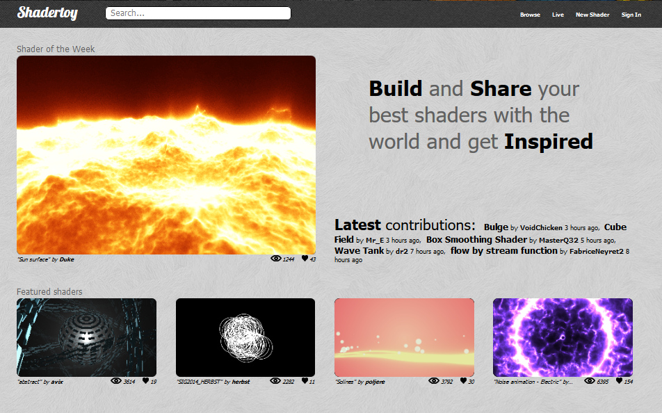

[down]

- <!-- .element: class="fragment" data-fragment-index="1"-->めっちゃすごい作品がたくさんある

    - <!-- .element: class="fragment" data-fragment-index="1"-->右上の「Browse」のところから作品の一覧が見れる

- <!-- .element: class="fragment" data-fragment-index="2"-->幾何的に面白いものや、かなりリアリティのあるものもある

    - <!-- .element: class="fragment" data-fragment-index="2"-->中にはゲームを作る猛者も！

- <!-- .element: class="fragment" data-fragment-index="3"-->色々と見て回るだけでも創作意欲が掻き立てられる

[next]
### アカウントを作る
---
- <!-- .element: class="fragment" data-fragment-index="1"-->作った作品を保存したり公開したりできるようになる

    - <!-- .element: class="fragment" data-fragment-index="2"-->右上の「Sign in」をクリック

    <!-- .element: class="fragment" data-fragment-index="2"-->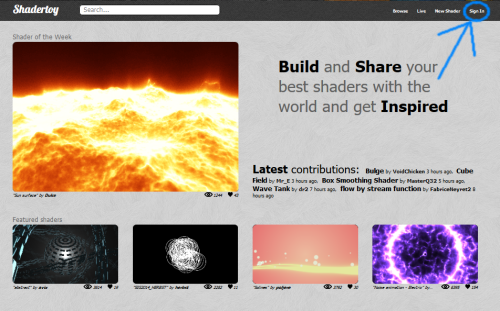

    - <!-- .element: class="fragment" data-fragment-index="3"-->右側のところに適当にアカウント情報書いてSign up

[next]

### 実際にShaderをかいてみよう
---
- <!-- .element: class="fragment" data-fragment-index="1"-->上部メニューの「New Shader」をクリック

<!-- .element: class="fragment" data-fragment-index="1"-->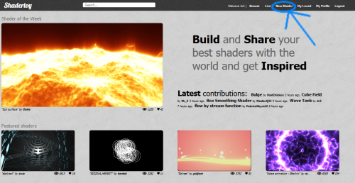

[down]

これがShadertoyでの編集画面

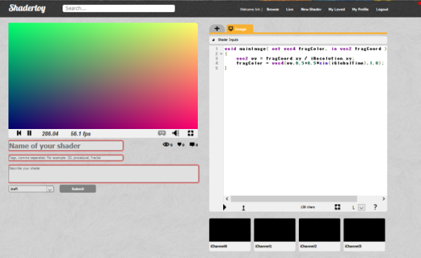

- <!-- .element: class="fragment"-->左側のグラデーションがShaderで描かれた画像

- <!-- .element: class="fragment"-->右側のエディタ部分でコーディングしてShaderを書いていく

[next]

### デフォルトのコードを見てみよう

``` glsl
void mainImage( out vec4 fragColor, in vec2 fragCoord )
{
	vec2 uv = fragCoord.xy / iResolution.xy;
	fragColor = vec4(uv,0.5+0.5*sin(iGlobalTime),1.0);
}
```

- <!-- .element: class="fragment"-->これはGLSL(OpenGL Shading Language)というプログラミング言語

    - <!-- .element: class="fragment"-->シェーディング言語(shading language)の一つ

    - <!-- .element: class="fragment"-->C言語をベースとした言語

    - <!-- .element: class="fragment"-->documentは[ここ](https://www.opengl.org/documentation/glsl/)にあるけど、C言語とか使ったことある人は馴染みやすいかと思う

[down]

``` glsl
void mainImage( out vec4 fragColor, in vec2 fragCoord )
{
	// 関数の中身
}
```

- <!-- .element: class="fragment"-->mainImageは、返り値がvoid型で引数にvec4型のfragColorとvec2型のfragCoordを取る関数

    - <!-- .element: class="fragment"-->vec2, vec4というのは、それぞれfloat値を成分に持つ二次元ベクトル、四次元ベクトルを表す型

    - <!-- .element: class="fragment"-->fragCoordは「今から色を決めようとしているピクセルの座標(左下原点)」

    - <!-- .element: class="fragment"-->fragColorは「xyzw成分にそれぞれそのピクセルのRGBA成分をもったベクトル」

[down]

``` glsl
void mainImage( out vec4 fragColor, in vec2 fragCoord )
{
	// 関数の中身
}
```

- <!-- .element: class="fragment"-->引数にinをつけると、値が渡される

- <!-- .element: class="fragment"-->引数にoutをつけると、参照が渡される(ただし、初期化はされない)

- <!-- .element: class="fragment"-->inもoutも付けなかった場合は、inを付けた場合と同じ

[down]

``` glsl
vec2 uv = fragCoord.xy / iResolution.xy;
```

- <!-- .element: class="fragment"-->flagCoordはmainImageの引数

- <!-- .element: class="fragment"-->では、iResolutionとはなにか

    - <!-- .element: class="fragment"-->エディタの上部にある「Shader Inputs」のところをクリックして下さい

[down]

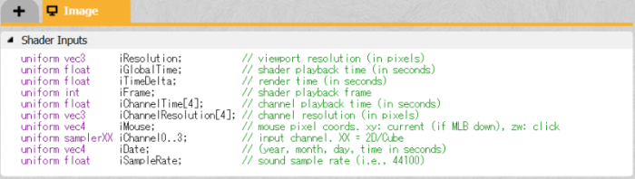

- <!-- .element: class="fragment"-->uniformとついた変数がたくさん宣言されている

    - <!-- .element: class="fragment"-->uniform変数は、Shaderの外部から渡される変数

    - <!-- .element: class="fragment"-->ゲームなどでShaderを書くときは、自分でこれらの変数を外部から持ってくる処理をしないといけない

    - <!-- .element: class="fragment"-->Shadertoyでは、あらかじめuniform変数が決まっている(iResolutionもその一つ)

    - <!-- .element: class="fragment"-->つまり、これらの変数はデフォルトで用意されていて、自動的に中身に情報が入ってきてくれている

[down]

``` glsl
uniform vec3      iResolution;           // viewport resolution (in pixels)
```

- <!-- .element: class="fragment"-->ここに書いている通り、iResolutionというのは描画領域の解像度(ピクセル単位)

    - <!-- .element: class="fragment"-->x成分は水平方向の解像度、y成分は垂直方向の解像度

    - <!-- .element: class="fragment"-->なぜか三次元ベクトルだけど、z成分は無視して良い

[down]

``` glsl
vec2 uv = fragCoord.xy / iResolution.xy;
```

- <!-- .element: class="fragment"-->注目している座標(fragCoord)のxy成分を描画領域の幅と高さで割ったものをuvという変数に代入

    - <!-- .element: class="fragment"-->GLSLでは「ベクトル / ベクトル」という演算は、各成分について除算することを示す

    - <!-- .element: class="fragment"-->他の演算子(+, -, \*など)についても同じで、各成分について演算を行う

        - <!-- .element: class="fragment"-->%という演算子はなく、かわりにmodという組み込み関数がある

[down]

- <!-- .element: class="fragment" data-fragment-index="1"-->このようにして得られたuvが何を意味するかというと

    - <!-- .element: class="fragment" data-fragment-index="2"-->描画領域の幅と高さを両方1としたときの注目ピクセルの座標

    <!-- .element: class="fragment" data-fragment-index="2"-->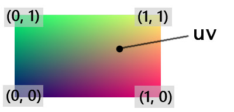

- <!-- .element: class="fragment" data-fragment-index="3"-->このような変換をすることによってあとあとの計算を楽にできる

[down]

``` glsl
fragColor = vec4(uv,0.5+0.5*sin(iGlobalTime),1.0);
```

- 次にここの処理だけど、わかりにくいので

    ``` glsl
    fragColor = vec4(uv,1.0,1.0);
    ```

    に書き換えよう

- <!-- .element: class="fragment"-->書き換えたらエディタ下部の「▶」のところをクリック

    - <!-- .element: class="fragment"-->コンパイルされて、書き換えた内容が反映される

    - <!-- .element: class="fragment"-->ちなみに「Alt+Enter」でもコンパイルできる

[down]

- <!-- .element: class="fragment" data-fragment-index="1"-->こんな感じになったらOK

    <!-- .element: class="fragment" data-fragment-index="1"-->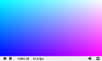

- <!-- .element: class="fragment" data-fragment-index="2"-->GLSLではRGBの上限値は1

- <!-- .element: class="fragment" data-fragment-index="3"-->一番左下のピクセルの色を決定するときfragCoordは(0, 0)なので、当然uvも(0, 0)になる

- <!-- .element: class="fragment" data-fragment-index="4"-->fragColorに代入される値は(0, 0, 1, 1)となる

- <!-- .element: class="fragment" data-fragment-index="5"-->第四成分は透明度だけど、Shadertoyでは無視してもよい

- <!-- .element: class="fragment" data-fragment-index="6"-->よってfragColorはRGB(0, 0, 1)、つまり左下は青色となる

[down]

- <!-- .element: class="fragment"-->今度は右上を見てみよう

    - <!-- .element: class="fragment"-->fragCoordは(iResolution.x, iResolution.y)なので、uvは(1, 1)になる

    - <!-- .element: class="fragment"-->fragColorに代入される値は(1, 1, 1, 1)となる

    - <!-- .element: class="fragment"-->よってfragColorはRGB(1, 1, 1)、つまり右上は白色となる

- <!-- .element: class="fragment"-->同様に左上、右下はそれぞれRGB(0, 1, 1)水色、RGB(1, 0, 1)ピンクになる

- <!-- .element: class="fragment"-->uvのx,y成分が[0, 1]の範囲でなめらかに変化するので、結果画面のようにキレイなグラデーションが表示される

[down]

- ここでfragColorの式を元に戻してみよう

    ``` glsl
    fragColor = vec4(uv,0.5+0.5*sin(iGlobalTime),1.0);
    ```

- <!-- .element: class="fragment"-->さっきまでの違いは、Blue成分が 0.5+0.5*sin(iGlobalTime) になっているだけ

    - <!-- .element: class="fragment"-->sinは三角関数のあれ。GLSLの組み込み関数

    - <!-- .element: class="fragment"-->iGlobalTimeはuniform変数の一つで経過時刻なので、時間経過とともに大きい値となる

    - <!-- .element: class="fragment"-->sinの値域は[-1, 1]なので、0.5をかけて0.5を足すことにより[0, 1]にしている

    - <!-- .element: class="fragment"-->よってBlue成分が時間経過とともに[0, 1]の範囲でsin波で変化するようになる

[down]

- 興味があったら
    ``` glsl
    fragColor = vec4(0.5+0.5*sin(iGlobalTime),uv,1.0);
    ```
    や
    ``` glsl
    fragColor = vec4(uv.x,0.5+0.5*sin(iGlobalTime),uv.y,1.0);
    ```
    など書き換えてみよう

[next]

- <!-- .element: class="fragment"-->このようにShadertoyではmainImage関数の中身を記述して、自分が作りたいものを実装していく

- <!-- .element: class="fragment"-->座標(fragCoord)を受け取って、その座標の色(fragColor)を指定するmainImage関数を作る

- <!-- .element: class="fragment"-->場合によってはuniform変数を用いる

[down]

mainImage関数のイメージはこんな感じ

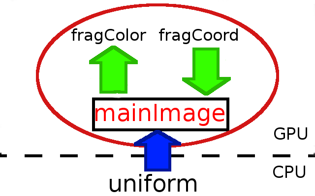

[next]

というわけで、Shaderをどんどん書いていこう

<!-- .element: class="fragment"-->と、その前にGLSLについて補足を

[down]

- 暗黙の型変換は許されない

    ``` glsl
    float x = 1;
    ```

    - これはコンパイルエラーになる

    正しくは

    ``` glsl
    float x = 1.0;
    ```

[down]

- ベクトルの各成分が等しい場合は簡略化して宣言できる

    例えば

    ``` glsl
    vec3 v1 = vec3(1.0);
    vec3 v2 = vec3(1.0, 1.0, 1.0);
    ```

    とかくと、v1==v2

[down]

- ベクトルとスカラーの演算はそのままに書ける

    ``` glsl
    vec3 v1 = 2.0 * vec3(1.0, 2.0, 3.0);
    vec3 v2 = vec3(2.0, 4.0, 6.0);
    ```

    とかくと、v1==v2

- sinやcosなどもベクトルの各成分に作用する

    ``` glsl
    vec3 v1 = sin(vec3(1.0, 2.0, 3.0));
    vec3 v2 = vec3(sin(1.0), sin(2.0), sin(3.0));
    ```

    とかくと、v1==v2

[down]

- if文は普通に使える

``` glsl
void mainImage( out vec4 fragColor, in vec2 fragCoord )
{
	vec2 uv = fragCoord.xy / iResolution.xy;

    if (uv.x > 0.5) {
        fragColor = vec4(1.0, 0.0, 0.0,1.0); // 右は赤色
    } else if (uv.y > 0.5) {
        fragColor = vec4(0.0, 1.0, 0.0,1.0); // 左上は緑色
    } else {
        fragColor = vec4(0.0, 0.0, 1.0,1.0); // 左下は青色
    }
}
```

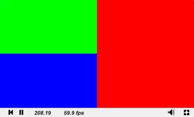

[down]

- for文はちょっと気をつけよう

    ``` glsl
    int M = 10;
    for(int i=0; i<M; i++) {
        // 処理
    }
    ```

    - 10回for文を回す処理

    - 実はこれコンパイルエラーになる

[down]

- 正しいfor文の使い方

``` glsl
const int M = 10;
for(int i=0; i<M; i++) {
    // 処理
}
```
``` glsl
for(int i=0; i<10; i++) {
    // 処理
}
```

constで定数にするか、いっそ文字を使わずに比較しよう

[down]

- for文の注意点2

    ``` glsl
    float x = 0.0;
    const int M = 10;
    for(int i=0; i<M; i++) {
       x += i;
    }
    ```

    - これもコンパイルエラー

    - for文の中の処理で、int型のiをキャストしないままfloat型のxと演算している

    - 正しくは

    ``` glsl
    x += float(i);
    ```

    - キャストの仕方が独特なので気をつけよう

[down]

- キャストが面倒であればiを初めからfloatにするのもあり

    ``` glsl
    float x = 0.0;
    for(float i=0.0; i<10.0; i++) {
        x += i;
    }
    ```

- ただし↓はコンパイルエラー
    ``` glsl
    float x = 0.0;
    for(float i=0.0; i<10; i++) {
        x += i;
    }
    ```

    - i<10のところで違う型同士で比較してるから

[next]

それではさっそく、Shaderを書いていこう

### ここからが本番<!-- .element: class="fragment"-->

[next]

#### 原点を中心にし、x方向とy方向の幅を同じにするような変換をする

``` glsl
void mainImage( out vec4 fragColor, in vec2 fragCoord )
{
	vec2 uv = fragCoord.xy / iResolution.xy;
    uv -= 0.5; //原点を中心に
    uv.x *= iResolution.x / iResolution.y; //x,yの幅を統一

    fragColor = vec4(uv, 1.0, 1.0);
}
```

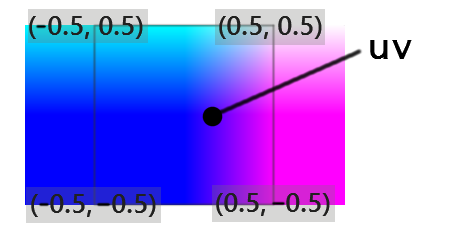

[down]

#### 光の球を表示しよう

``` glsl
void mainImage( out vec4 fragColor, in vec2 fragCoord )
{
	vec2 uv = fragCoord.xy / iResolution.xy;
    uv -= 0.5;
    uv.x *= iResolution.x / iResolution.y;

    float c = 1.0 / ( length(uv) * length(uv) ); //中心からの距離の2乗の逆数
    c *= 0.001; //適当に大きさ設定

    fragColor = vec4(vec3(c), 1.0); //
}
```

- $length(uv)$で$uv$ベクトルの大きさ($= \sqrt{(uv.x) ^2 + (uv.y) ^2}$)

- $uv$の示す点と原点との距離が得られる

[down]

#### 光の球を動かそう

``` glsl
void mainImage( out vec4 fragColor, in vec2 fragCoord )
{
	vec2 uv = fragCoord.xy / iResolution.xy;
    uv -= 0.5;
    uv.x *= iResolution.x / iResolution.y;

    uv.x += 0.2; uv.y += 0.3; //原点位置を移動

    float c = 1.0 / ( length(uv) * length(uv) );
    c *= 0.001;

    fragColor = vec4(vec3(c), 1.0);
}
```

- 原点が(-0.2, -0.3)になり、光の位置が移動する

[down]

#### 時間経過とともに光の球を動かそう

``` glsl
void mainImage( out vec4 fragColor, in vec2 fragCoord )
{
	vec2 uv = fragCoord.xy / iResolution.xy;
    uv -= 0.5;
    uv.x *= iResolution.x / iResolution.y;

    //原点を時間で変化
    uv.x += 0.2 * cos(iGlobalTime); //
    uv.y += 0.2 * sin(iGlobalTime); //

    float c = 1.0 / ( length(uv) * length(uv) );
    c *= 0.001;

    fragColor = vec4(vec3(c), 1.0);
}
```

- iGlobalTimeはこのシェーダが起動してからの時間(単位は秒)を表す

- iGlobalTimeを角度$\theta$として、原点の位置を$(-0.2\cos\theta, -0.2\sin\theta)$に移動

[down]

#### 光の色を変えよう

``` glsl
void mainImage( out vec4 fragColor, in vec2 fragCoord )
{
	vec2 uv = fragCoord.xy / iResolution.xy;
    uv -= 0.5;
    uv.x *= iResolution.x / iResolution.y;

    uv.x += 0.2 * cos(iGlobalTime);
    uv.y += 0.2 * sin(iGlobalTime);

    float c = 1.0 / ( length(uv) * length(uv) );
    c *= 0.001;

    fragColor = vec4(c, c * .2, c * .4, 1.0); //色を変更
}
```
- GLSLでは、.2や.4はそれぞれ0.2, 0.4と同じ

    - このような挙動をする言語は多い(C,C++,Java, etc.)

    - ちなみに2.や4.は2.0, 4.0と同じ

- fragColorのGreen成分とBlue成分を少し小さくすることで赤っぽい色になる

[down]

#### 光の軌道を変えてみよう

``` glsl
void mainImage( out vec4 fragColor, in vec2 fragCoord )
{
	vec2 uv = fragCoord.xy / iResolution.xy;
    uv -= 0.5;
    uv.x *= iResolution.x / iResolution.y;

    // 軌道の変更
    uv.x += .2 * sin(iGlobalTime * 2.); //
    uv.y += .2 * sin(iGlobalTime * 3.); //

    float c = 1.0 / ( length(uv) * length(uv) );
    c *= 0.001;

    fragColor = vec4(c, c * .2, c * .4, 1.0);
}
```

- 光の軌道を$(-0.2\sin 2\theta, -0.2\sin 3\theta)$に変更

[down]

- リサージュ曲線の一つ

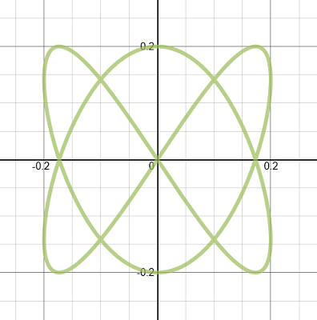

$x=0.2\sin 2\theta$

$y=0.2\sin 3\theta$

[down]

#### for文を使おう

``` glsl
void mainImage( out vec4 fragColor, in vec2 fragCoord )
{
    fragColor = vec4(0); //
    for (int i = 0; i < 10; i++) { //
        vec2 uv = fragCoord.xy / iResolution.xy;
        uv -= 0.5;
        uv.x *= iResolution.x / iResolution.y;

        uv.x += .2 * sin(iGlobalTime * 2.);
        uv.y += .2 * sin(iGlobalTime * 3.);

        float c = 1.0 / ( length(uv) * length(uv) );
        c *= 0.001;

        fragColor += vec4(c, c * .2, c * .4, 1.0); //
    } //
}
```

- for文で色を10回加算させてるので、光の強度が増す

[down]

#### 光の軌跡を描こう

``` glsl
void mainImage( out vec4 fragColor, in vec2 fragCoord )
{
    fragColor = vec4(0);
    for (int i = 0; i < 200; i++) { // ループ回数を増やす
        vec2 uv = fragCoord.xy / iResolution.xy;
        uv -= 0.5;
        uv.x *= iResolution.x / iResolution.y;

        // リサージュ曲線の媒介変数を、iGlobalTimeとiに依る変数にする
        float t = iGlobalTime + float(i) * 0.1; //
        uv.x += .2 * sin(t * 2.); //
        uv.y += .2 * sin(t * 3.); //

        float c = 1.0 / ( length(uv) * length(uv) );
        c *= 0.0001; //点の数が多すぎると光りすぎるのでちょっと弱くする

        fragColor += vec4(c, c * .2, c * .4, 1.0);
    }
}
```

- リサージュ曲線の媒介変数にiを用いる

- <!-- .element: class="fragment"-->三角関数の中身を変えてみたり、色を変えてみたり遊んでみよう！

- <!-- .element: class="fragment"-->完成したShaderのデモは[こちら](https://www.shadertoy.com/view/lsyGRm)

[next]

#### おまけ

``` glsl
#define PI 3.14159265258979
void mainImage( out vec4 fragColor, in vec2 fragCoord )
{
    fragColor = vec4(sin(vec3(-1.0,0.0,1.0)*(2.0*PI/3.0) + iGlobalTime)*0.5+0.5, 0.0);
}
```

- <!-- .element: class="fragment" data-fragment-index="1"-->縦軸RGB成分、横軸iGlobalTime
<!-- .element: class="fragment" data-fragment-index="1"-->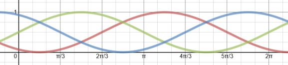

- <!-- .element: class="fragment" data-fragment-index="2"-->実際の色相環の360°ループはこんな感じ
<!-- .element: class="fragment" data-fragment-index="2"-->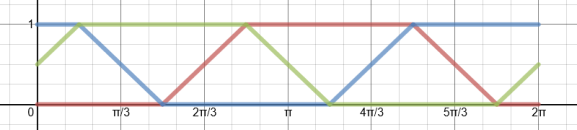

[next]

### 保存の仕方

---

- 作ったShaderプログラムを保存できる

- 左下のところで「タイトル」「タグ」「説明」「保存形式」を埋めてSubmit

    - タイトルはすでに存在するものと同じものにはできない

- 保存形式について。とりあえず、privateかdraftで保存

    - public ... 公開。一般の人も見れる

    - private ... 部分的に公開。URLを知っている人だけ見れる

    - draft ... 一時保存(非公開)。自分しか見ることができない

[next]

休憩

[next]

## マンデルブロ集合を描こう

---

- <!-- .element: class="fragment" data-fragment-index="1"-->マンデルブロ集合とは、漸化式

    - <!-- .element: class="fragment" data-fragment-index="1"-->$z\_0 = 0$

    - <!-- .element: class="fragment" data-fragment-index="1"-->$z\_n=z\_{n-1}^2+c$

    <!-- .element: class="fragment" data-fragment-index="1"-->で定義される複素数列$\\{z\_n\\}$について$\lim\_{n\to\infty} |z\_n|$が収束するような複素数$c$の集合

[down]

これを複素平面上に図示するとこうなる

<!-- .element: class="fragment" -->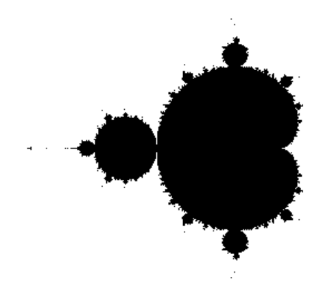

- <!-- .element: class="fragment" -->これをShaderで描画してみよう

- <!-- .element: class="fragment" -->今度は自分たちで頑張って作ってみてください！

[down]

#### ヒント

- <!-- .element: class="fragment" -->複素数はvec2型の変数で表現

    - <!-- .element: class="fragment" -->x成分に実部、y成分に虚部をもたせる

- <!-- .element: class="fragment" -->収束しやすいのは$|c|$が0に近い時なので、原点を中心になるように座標変換し、変換後の座標をcとして使う

- <!-- .element: class="fragment" -->収束するかどうかの判定は厳密にはできない(or難しい)ので、なにか適当な方法を考える

    - <!-- .element: class="fragment" -->定数回for文を回して$|z\_n|$の変化具合を見る

- <!-- .element: class="fragment" -->発散するかしないかで色を変える

[down]

正解例は[こちら](https://www.shadertoy.com/view/MddXz8)

- <!-- .element: class="fragment" -->興味があったら発散速度に応じてグラデーションをつけてみよう

    - <!-- .element: class="fragment" -->コード例は[こちら](https://www.shadertoy.com/view/4sGGRW)

- <!-- .element: class="fragment" -->マンデルブロ集合はフラクタル図形の一種なので、拡大してみるのも面白い

[next]

休憩

[next]

## バッファ
---
- <!-- .element: class="fragment"-->
Q. ゲーム作りたくない？

    - <!-- .element: class="fragment"-->
A. 状態を保持できないので無理

- <!-- .element: class="fragment"-->
Q. 状態保持したくない？

    - <!-- .element: class="fragment"-->
A. わかる

[down]

### 複数のシェーダ

- <!-- .element: class="fragment" data-fragment-index="1"-->今まで書いてきたシェーダは画面に表示されるもののみ

- <!-- .element: class="fragment" data-fragment-index="2"-->Shadertoyでは画面に表示されないシェーダも書ける
    - <!-- .element: class="fragment" data-fragment-index="2"-->見えないだけでメモリ(=バッファ)に描画されている

<!-- .element: class="fragment" data-fragment-index="2"-->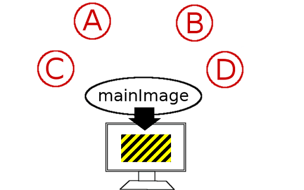

[down]

- それぞれのシェーダでは他のシェーダの「1フレーム前の」バッファを参照できる
- 自分自身のバッファも参照可能

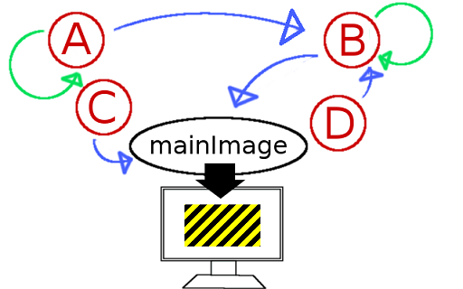

[down]

### これって

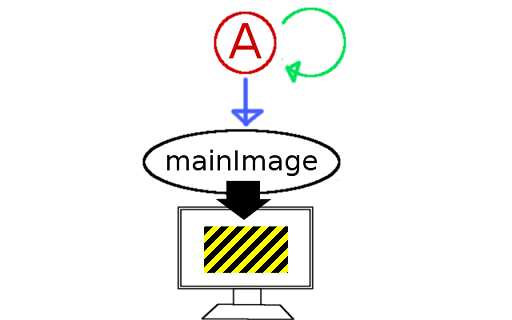

[down]

### こういうこと

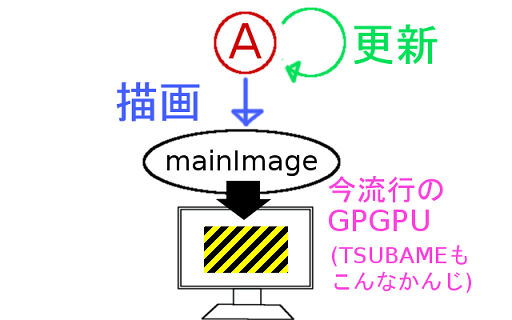
- 状態の保存ができる
- 動くものがつくれる！

[down]

### 動くものがつくれる！

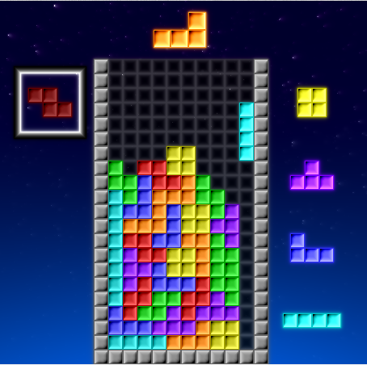
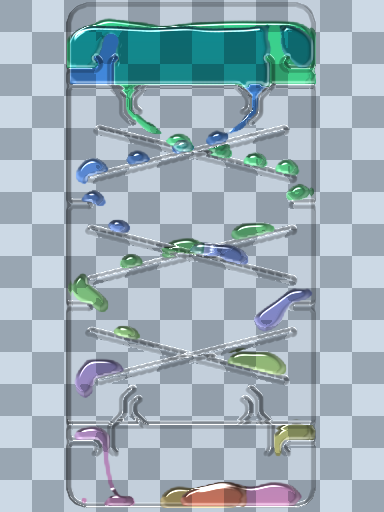
- 左:http://bit.ly/2548wj5 (Shadertoy, phi16)
- 右:http://bit.ly/1U7vcvp (Flash, シアンちゃん)


[down]

### 具体的には
- チャンネルにバッファを指定
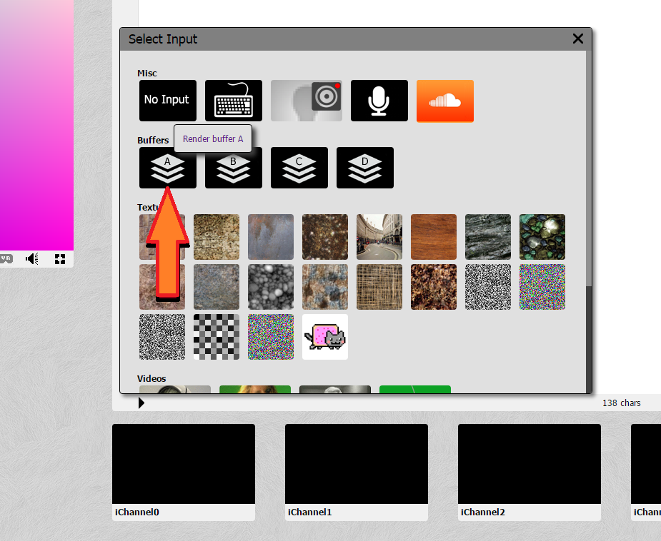

[down]

- バッファ用シェーダを用意(Buffer A)

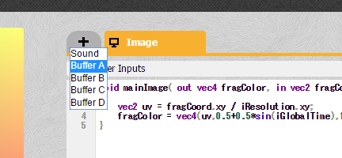

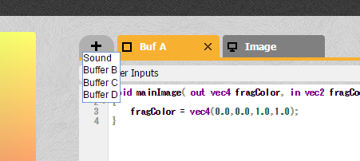

- デフォルトでは「常に全ピクセルが青」のバッファ

[down]

- 読み取るときは
    ```
    texture2D(チャンネル名, ピクセル位置)
    ```
位置はvec2(x,y)共に0～1で指定なので
    ``` glsl
    texture2D(iChannel0, vec2(x,y)/iResolution.xy)
    ```
これでvec4が返るので色(vec3)を取るときは
    ``` glsl
    texture2D(iChannel0, vec2(x,y)/iResolution.xy).xyz
    ```

[down]

一つ左のピクセルをコピーし続けるプログラム
- Buf A
```
vec3 rand(float x){ //好きな関数
    return fract(sin(vec3(0,1,-1)*12.9898+(x+iGlobalTime)*78.233) * 43758.5453);
}
void mainImage( out vec4 fragColor, in vec2 fragCoord ){
    fragCoord.x--;
    vec3 c = texture2D(iChannel0,fragCoord.xy/iResolution.xy).xyz;
    fragColor.xyz = c;
    if(fragCoord.x < 0.)fragColor.xyz = rand(fragCoord.y); //x=0のときだけ適当に値をいれる
    fragColor.w = 1.;
}
```
- Image
```
void mainImage( out vec4 fragColor, in vec2 fragCoord ){
    vec3 c = texture2D(iChannel0,fragCoord.xy/iResolution.xy).xyz;
    fragColor = vec4(c,1.0); //Buf Aをそのまま表示
}
```

[down]

#### というわけで

[down]

### ライフゲーム
---
- 2次元平面上で各点が0(死)か1(生)のどちらか
- 自分が1で、周り8つの内生きている点が2個か3個なら次も生、そうでなければ死
- 自分が0で、周り8つの内生きている点が3個なら次は生、そうでなければ死のまま

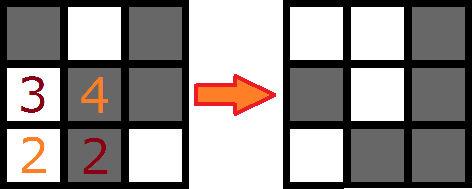

- 実装してみよう！

[down]

- こんな感じ

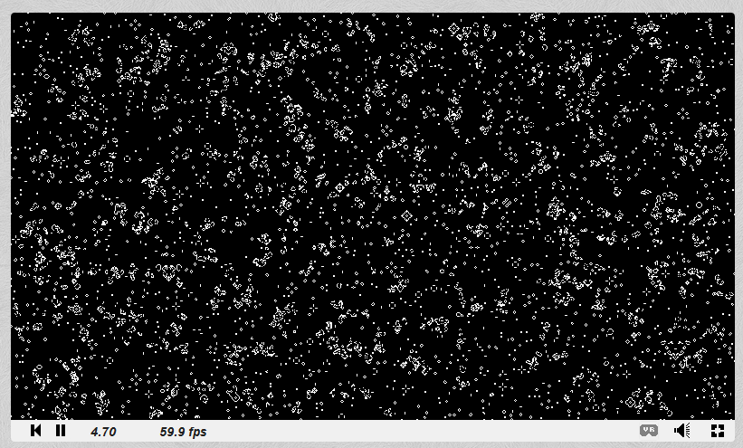

[down]

#### ヒント

- まずデータの読み込みをする関数を作ると楽。座標を受け取って前フレームの色を参照してint(0か1)を返す。
    ```
    int read(vec2 p){
        vec3 v = texture2D(iChannel0,p/iResolution.xy).xyz;
        return v.x > 0.5 ? 1 : 0;
    }
    ```
- 自分自身の生死はread(fragCoord)
- 周囲はread(fragCoord + vec2(1,1))など。8個だけなのでCopy&Pasteでも。
    - 端の処理は気にしなくていい(常に0)
- 次の生死が分かったらfragCoord.xに1.0か0.0を入れる。
- そこまでできればImage側で表示するだけ。
    - xだけに入れてるなら.xxxで参照するとvec3を得られる

[down]

完成品が[これ](https://www.shadertoy.com/view/MdcXzH)

- 追加するとすれば？
    - マウスクリックで周辺のセルの生死を書き換える(ぐりぐりして遊べる)
    - 細かくて見難いのでマウス周辺を拡大する機能
- ライフゲームはそれ自体が面白いので興味あれば調べてみると良いです
    - セルの相互作用でコンピュータも作れるよ

[next]


以上で講習会は終わります。

ご清聴ありがとうございました。
